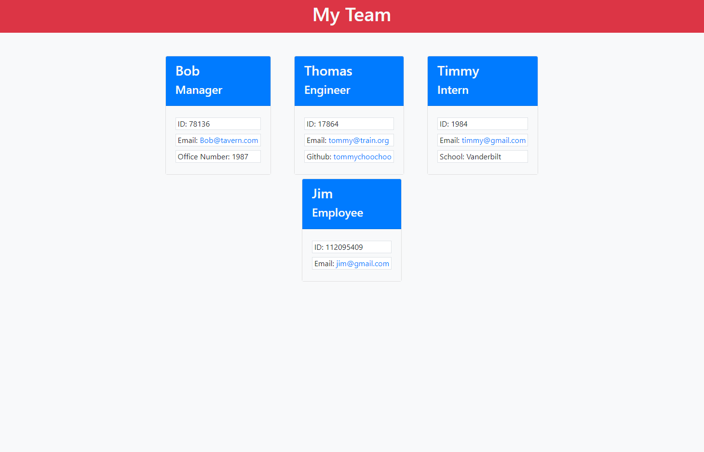

# Team Profile Generator

## About the Project
Welcome to my team profile generator! Using this application, you can easily organize your team's information. Invoked from the command line, a series of prompts will be displayed that will generate a profile for your team.

## Table of Contents
- [Installation Instructions](#installation-instructions)
- [Examples of Use](#examples-of-use)
- [Contributions](#contributions)
- [License Information](#license-information)
- [Contact Me](#contact-me)
## Installation Instructions
  1. Install Node.js      
  2. Clone the repository and navigate to it via the command line.
  3. Initialize npm with `npm init -y` then install required packages with `npm install jest fs inquirer`     
  4. Type the command `node index.js` and answer the prompts!

  - 

## Examples of Use
  You can use this application to easily organize your team members, either as a manager or team leader!
## Contributions
 - Completed with direction from the Vanderbilt Full-Stack Coding Bootcamp 
## License Information
  Copyright (c) by William Ingram, 2022
  
  Licensed under the [MIT](https://opensource.org/licenses/MIT) license.
## Contact Me
- GitHub: wingram1
- Email: waingram96@gmail.com
